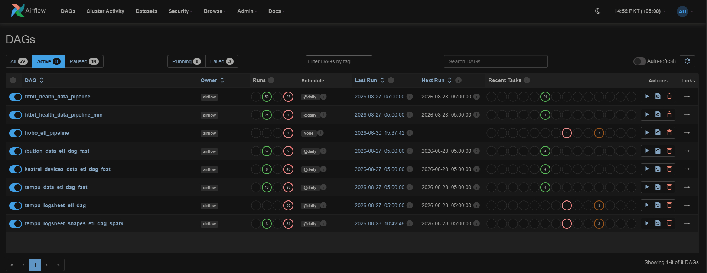
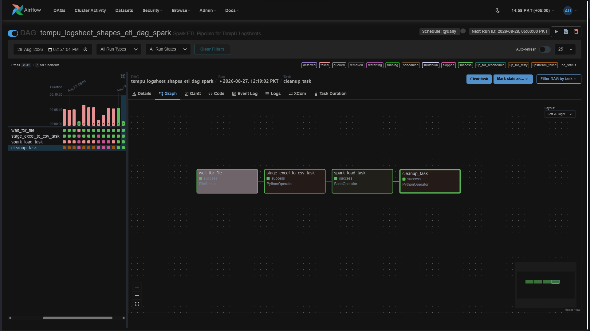
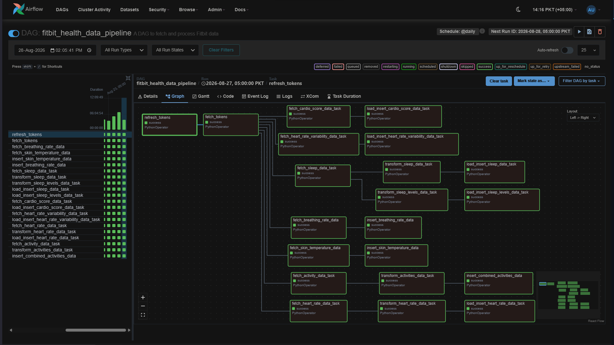

# Climate-Health Research Data Ingestion Engine
### Apache Airflow | PySpark | REST Web APIs | Pandas | SQL Server | Docker

An enterprise-grade, fault-tolerant ETL pipeline built to orchestrate, clean, validate, and load high-throughput climate-health telemetry data. The engine seamlessly processes both live REST Web API payloads and batch-processed field sensor logsheets (`.csv`, `.xlsx`), implementing automated row-level quarantine and pre-database deduplication to protect relational data integrity.

## 📊 Pipeline Orchestration & DAG Workflows

### 1. Ingestion Engine Overview

  
   
  <b>Figure 1:</b> Apache Airflow dashboard displaying active multi-source ETL DAG schedules and execution metrics.

---

### 2. Sensor Logsheet Processing Workflow (`TempU-03 / SHAPES`)

  
   
  <b>Figure 2:</b> Task graph executing CSV logsheet parsing, timeline overlap auditing, SQL Server deduplication, and row-level quarantine exports.

---

### 3. REST Web API Telemetry Ingestion (`Fitbit API`)

  
   
  <b>Figure 3:</b> Automated API fetch DAG managing bearer token authentication, rate-limited pagination, and direct SQL target ingestion.

